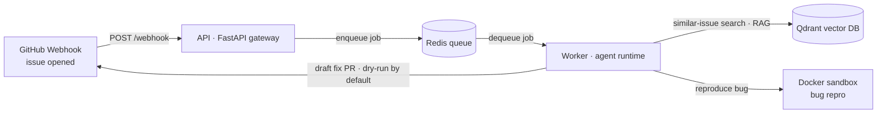

# Triage Agent

> An **autonomous GitHub issue-triage agent**. When a new issue is opened on a
> target repo, it uses **RAG** to find similar past issues (smart duplicate
> detection), **reproduces bugs inside a sandboxed Docker container**, classifies
> severity, and **drafts fix PRs for trivial bugs** — all behind safety
> guardrails with a **dry-run default**. It runs as two services (a FastAPI
> gateway + an agent worker) backed by Qdrant (vector DB) and Redis (queue), all
> containerized.

---

## Architecture



---

## Tech stack

| Layer            | Choice                                             |
| ---------------- | -------------------------------------------------- |
| Language         | Python 3.11                                        |
| API gateway      | FastAPI + Uvicorn                                  |
| Config           | pydantic-settings (single source in `shared/config.py`) |
| Vector DB        | Qdrant                                             |
| Queue / broker   | Redis                                              |
| Sandbox          | Docker (resource-limited containers)               |
| Orchestration    | LangGraph *(Phase 4)*                              |
| Embeddings       | sentence-transformers / OpenAI *(Phase 1)*         |
| Tooling          | ruff + black + pre-commit, pytest                  |
| Runtime          | docker-compose                                     |

---

## Quickstart

```bash
# 1. Configure
cp .env.example .env          # then fill in real keys (GITHUB_TOKEN, OPENAI_API_KEY, ...)

# 2. Boot the stack (api + worker + qdrant + redis)
make up                       # == docker compose up --build

# 3. Verify the gateway
curl localhost:8000/health    # -> {"status":"ok"}
```

Run the tests and linters locally (no Docker needed):

```bash
pip install -r requirements.txt
make test                     # pytest
make lint                     # ruff check . && black --check .
```

### RAG ingestion (Phase 1)

Index a repository's issues for duplicate detection and fix-pattern retrieval.
The first run downloads the embedding model (`all-MiniLM-L6-v2`, ~90 MB) and the
cross-encoder reranker; embeddings are cached on disk (`.cache/embeddings/`) so
re-ingestion is cheap and idempotent. Set `GITHUB_TOKEN` for anything beyond
GitHub's unauthenticated rate limit.

```bash
docker compose up -d qdrant                       # vector store only
python -m rag.ingest --repo OWNER/REPO --limit 100
curl http://localhost:6333/collections/issues     # points_count > 0
```

```python
from rag.retrieve import find_similar_issues
find_similar_issues("app crashes on startup", mode="duplicate")  # semantic dup detection
find_similar_issues("fix the CSV export timeout", mode="fix")    # closed issues + PR diffs
```

### Event pipeline & dashboard (Phase 2)

The API receives GitHub `issues` webhooks, **verifies the HMAC signature**
(`X-Hub-Signature-256`, fails closed), normalizes the payload, and enqueues a
triage job to Redis. The worker (RQ) runs a stub handler that records a
`TriageRun` to the Redis-backed run store. A minimal dashboard at `/` shows
recent runs and their reasoning trace.

```bash
cp .env.example .env          # set GITHUB_WEBHOOK_SECRET (the demo signs with it)
make up                       # api + worker + qdrant + redis
make demo                     # POST a signed issues.opened webhook -> 202 + run_id
open http://localhost:8000/   # watch the run appear, click it for the step trace
curl localhost:8000/status    # recent runs as JSON
```

| Route | Purpose |
| --- | --- |
| `POST /webhook` | verify signature → normalize → enqueue (202), ignore non-opened/PRs (200) |
| `GET /status`, `GET /status/{id}` | recent runs / one run with full step trace |
| `POST /reindex` | kick off RAG ingestion in the background (202, non-blocking) |
| `GET /` | server-rendered dashboard |

### Sandboxed bug reproduction (Phase 3)

The **only** place allowed to execute untrusted, issue-derived code. It runs the
snippet in a throwaway Docker container locked down per `sandbox/policy.py`:
**no network**, read-only rootfs, all Linux caps dropped, `no-new-privileges`,
non-root user, CPU/memory/PID caps, a small writable tmpfs, a hard wall-clock
timeout, and **guaranteed container removal**. A bug "reproduces" when the
program exits non-zero and didn't time out. Not yet wired into the worker (Phase 4).

Requires a reachable Docker daemon (Docker-out-of-Docker via the host socket).

```python
from sandbox.runner import SandboxRunner
from sandbox.schemas import ReproRequest

SandboxRunner().run(ReproRequest(
    files={"repro.py": "raise SystemExit(1)"},
    command=["python", "repro.py"],
))  # -> ReproResult(reproduced=True, exit_code=1, timed_out=False, ...)
```

---

## Project status

Built in 7 phases; each adds one real capability on top of a proven skeleton.

- [x] **Phase 0 — Scaffold & infra.** Two-service skeleton (FastAPI + worker),
      Qdrant + Redis, docker-compose, config, tooling. Boots with stubs.
- [x] **Phase 1 — RAG ingestion + retrieval.** GitHub fetch (issues, comments,
      linked-PR diffs), token-aware chunking, ST/OpenAI embeddings with on-disk
      cache, Qdrant index, cross-encoder reranking; `duplicate` + `fix` retrieval.
- [x] **Phase 2 — Event gateway.** Signature-verified webhook → Redis queue →
      RQ worker → run store → dashboard. Stub triage handler (real agent in Phase 4).
- [x] **Phase 3 — Sandboxed reproduction.** Locked-down Docker runner (no net,
      read-only FS, dropped caps, non-root, CPU/mem/PID caps, hard timeout,
      guaranteed cleanup) that confirms whether a bug reproduces. Stands alone.
- [ ] **Phase 4 — Agent orchestration.** LangGraph state machine: classify →
      repro → decide.
- [ ] **Phase 5 — Fix drafting & safe writes.** Draft PRs for trivial bugs;
      dry-run / live-write guardrails.
- [ ] **Phase 6 — Evaluation.** Triage-accuracy and reproduction-rate metrics.

---

## Demo

_Filled in a later phase._

## Evaluation results

_Filled in Phase 6._

## Limitations

_Filled in a later phase._
