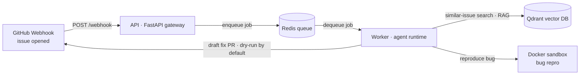

# Triage Agent

> An **autonomous GitHub issue-triage agent**. When a new issue is opened on a
> target repo, it uses **RAG** to find similar past issues (smart duplicate
> detection), **reproduces bugs inside a sandboxed Docker container**, classifies
> severity, and **drafts fix PRs for trivial bugs** — all behind safety
> guardrails with a **dry-run default**. It runs as two services (a FastAPI
> gateway + an agent worker) backed by Qdrant (vector DB) and Redis (queue), all
> containerized.

---

## Architecture



---

## Tech stack

| Layer            | Choice                                             |
| ---------------- | -------------------------------------------------- |
| Language         | Python 3.11                                        |
| API gateway      | FastAPI + Uvicorn                                  |
| Config           | pydantic-settings (single source in `shared/config.py`) |
| Vector DB        | Qdrant                                             |
| Queue / broker   | Redis                                              |
| Sandbox          | Docker (resource-limited containers)               |
| Orchestration    | LangGraph *(Phase 4)*                              |
| Embeddings       | sentence-transformers / OpenAI *(Phase 1)*         |
| Tooling          | ruff + black + pre-commit, pytest                  |
| Runtime          | docker-compose                                     |

---

## Quickstart

```bash
# 1. Configure
cp .env.example .env          # then fill in real keys (GITHUB_TOKEN, OPENAI_API_KEY, ...)

# 2. Boot the stack (api + worker + qdrant + redis)
make up                       # == docker compose up --build

# 3. Verify the gateway
curl localhost:8000/health    # -> {"status":"ok"}
```

Run the tests and linters locally (no Docker needed):

```bash
pip install -r requirements.txt
make test                     # pytest
make lint                     # ruff check . && black --check .
```

---

## Project status

Built in 7 phases; each adds one real capability on top of a proven skeleton.

- [x] **Phase 0 — Scaffold & infra.** Two-service skeleton (FastAPI + worker),
      Qdrant + Redis, docker-compose, config, tooling. Boots with stubs.
- [ ] **Phase 1 — RAG / duplicate detection.** Embed & index issues in Qdrant;
      similar-issue search + reranking.
- [ ] **Phase 2 — GitHub ingestion.** Webhook receiver, signature verification,
      issue fetch/normalize.
- [ ] **Phase 3 — Sandboxed reproduction.** Reproduce bugs in resource-limited
      Docker containers.
- [ ] **Phase 4 — Agent orchestration.** LangGraph state machine: classify →
      repro → decide.
- [ ] **Phase 5 — Fix drafting & safe writes.** Draft PRs for trivial bugs;
      dry-run / live-write guardrails.
- [ ] **Phase 6 — Evaluation.** Triage-accuracy and reproduction-rate metrics.

---

## Demo

_Filled in a later phase._

## Evaluation results

_Filled in Phase 6._

## Limitations

_Filled in a later phase._
